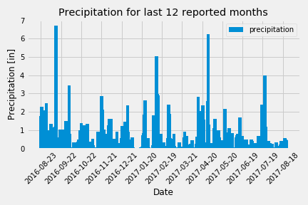
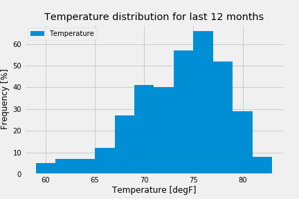
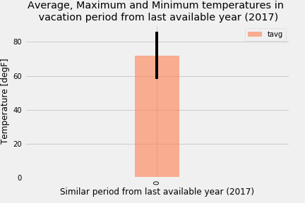
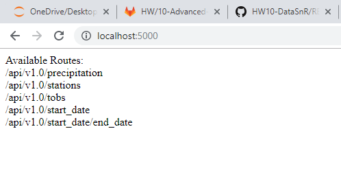
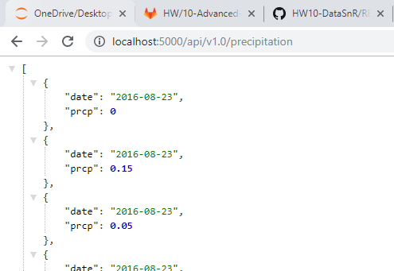
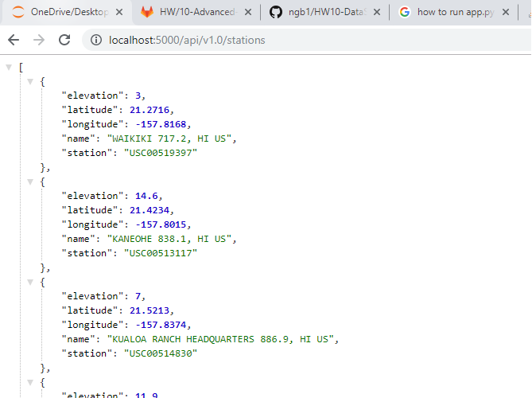
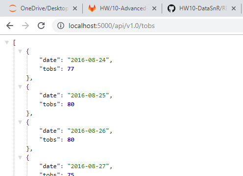
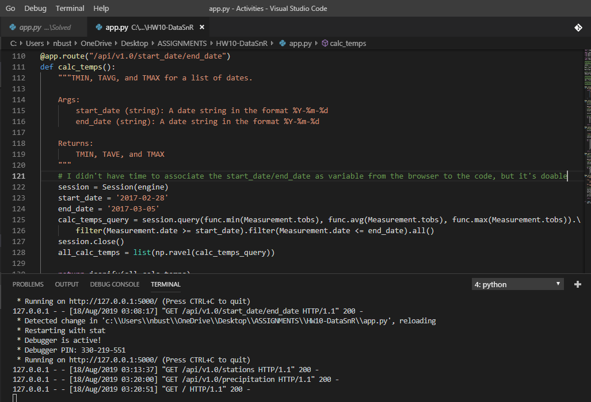

# HW10-Advanced-Data-Storage-and-Retrieval
## 10-Surfs Up!

I've decided to treat myself to a long holiday vacation in Maui, Hawaii! To help with my trip planning, I needed to do some climate analysis on the area. The following outlines what I did.

The dates I'm planning to visit the Aloha state are:

- FROM: 2020-02-28
- TO:   2020-03-05

## Step 1 - Climate Analysis and Exploration

To begin, I used Python and SQLAlchemy to do basic climate analysis and data exploration of your climate database. All of the following analysis should be completed using SQLAlchemy ORM queries, Pandas, and Matplotlib.

I use the provided starter notebook and hawaii.sqlite files to complete  climate analysis and data exploration, considering the dates mentioned above. 
I also used SQLAlchemy create_engine to connect to your sqlite database, and SQLAlchemy automap_base() to reflect my tables into classes and saved a reference to those classes called Station and Measurement.

ALL THE CODES ARE ON THE JUPYTER NOTEBOOK FILE (FINAL)

### Precipitation Analysis

I designed a query to retrieve the last 12 months of precipitation data, selected only the date and prcp values and loaded the query results into a Pandas DataFrame and set the index to the date column.
I also sorted the DataFrame values by date,  plotted the results using the DataFrame plot method and used Pandas to print the summary statistics for the precipitation data.

It can be observed from the plot above that in average precipitation throughout the year is lower than 4in per day, with exception of the following periods:
- last week of August
- third week of January
- second week of April
- last week of June

In general the probability of precipitation is low, with a mean of 0.2 in of water per day.

Precipitation for the dates are selected are relatively low if compared with last available values.

### Station Analysis

I designed a query to calculate the total number of stations (9 in total), from the list below, the most active station is USC00519281 with 2772 observations, whereas the least active is USC00518838 with 511:

[('USC00519281', 2772),
 ('USC00519397', 2724),
 ('USC00513117', 2709),
 ('USC00519523', 2669),
 ('USC00516128', 2612),
 ('USC00514830', 2202),
 ('USC00511918', 1979),
 ('USC00517948', 1372),
 ('USC00518838', 511)]

I design a query to retrieve the last 12 months of temperature observation data (tobs). I filtered the data by the station with the highest number of observations (USC00519281) and plotted the results as a histogram with bins=12 as shown below.

Based on the histogram above, it's very likely (more than 60%) to have tempeatures around 76 degF. 

On the other hand it is unlikely to have temperatures higher than 80 degF and lower than 67 degF (less than 30%)

### Temperature Analysis II

The starter notebook contains a function called calc_temps that will accept a start date and end date in the format %Y-%m-%d and return the minimum, average, and maximum temperatures for that range of dates.
I used the calc_temps function to calculate the min, avg, and max temperatures for my trip using the matching dates from the previous available year.

I plotted the min, avg, and max temperature from my previous query as a bar chart.

I use the average temperature as the bar height, and the peak-to-peak (tmax-tmin) value as the y error bar (yerr).

The expected average temperature during the period I'm planning to visit Hawaii is around 70 degF.

## Step 2 - Climate App

After completing the initial analysis, I designed a Flask API based on the queries that I developed. I used FLASK to create my routes.

### Routes

#### /index
Home page.
Listed all routes that are available.

#### /api/v1.0/precipitation
Converted the query results to a Dictionary using date as the key and prcp as the value.
Returned the JSON representation of the dictionary.

#### /api/v1.0/stations
Returned a JSON list of stations from the dataset.

#### /api/v1.0/tobs
queried for the dates and temperature observations from a year from the last data point.
Returned a JSON list of Temperature Observations (tobs) for the previous year.

#### /api/v1.0/ start>/ end>
Returned a JSON list of the minimum temperature, the average temperature, and the max temperature for a given start or start-end range.
When given the start only, calculated TMIN, TAVG, and TMAX for all dates greater than and equal to the start date.
When given the start and the end date, calculated the TMIN, TAVG, and TMAX for dates between the start and end date inclusive.
For this version the start_date and end_date were fixed, I couldn't find an option to associate the route on the website with the variables, but it's doable, it was just not covered in the course (I'll need to invest more time researching on the internet).

## Authors

* **Nicolas Gomez Bustamante** - *Initial work* - [PurpleBooth](https://github.com/nbg1)
